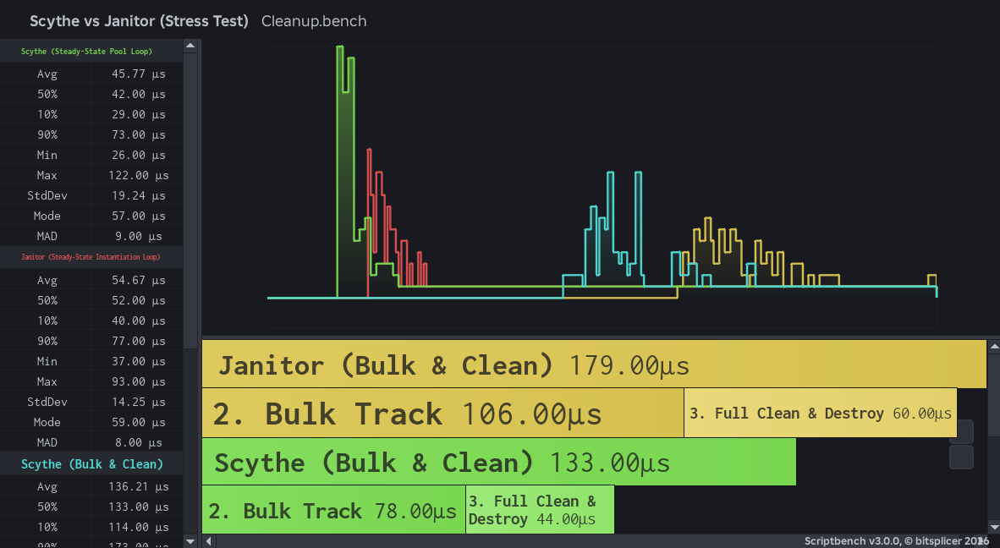

# Scythe 🔪🩸

A data-oriented cleanup library for [Luau](https://luau.org/).

Unlike conventional cleanup tools like Janitor, Maid, or Trove, **Scythe** uses no objects, no metatables, and has zero per-instance allocation cost. A scope is simply an integer handle referencing module-level Structure-of-Arrays (SoA) storage.

---

## Key Features

- ⚡ **Zero Per-Instance Allocation Overhead**: Scopes are managed as integer handles backed by module-level SoA buffers.
- 🚀 **Fast Disposal Loop**: The disposal method is resolved **once** at `add` time and stored as a `u8` tag. The `clean` hot loop is a branch on an integer read straight out of a buffer - avoiding `typeof`, method sniffing, and `pcall` overhead.
- 🔄 **LIFO Cleanup Order**: Resources are disposed in reverse insertion order (Last-In, First-Out), matching resource acquisition semantics.
- ♻️ **Pooled Handles**: Scope handles are recycled to maintain optimal memory and cache performance.

--

## Benchmarks

Scythe consistently outperforms howmanysmall's Janitor across multiple metrics by about 25-30% in execution time.



Memory Allocation & GC Pressure

- Cold Allocation: Scythe aggressively pre-allocates contiguous item arrays and capacity buffers. On first-pass bulk allocation, cold memory footprint is higher than lazily-evaluated dictionaries due to reserved capacity.
- Warm Pool: Scope handles `u32` and underlying item buffers are pooled upon `Scythe.destroy()`. In steady-state execution, recycling handles via `freeStack` yields zero heap allocations (ΔMem = 0 KB), completely removing garbage collector pauses on high-frequency cleanup paths.

| Architecture   | Hot-Loop Clean | Steady-State GC Overhead    |
| -------------- | -------------- | --------------------------- |
| Janitor / Maid | O(N) Hash Map  | Continuous Heap Allocations |
| Scythe (SoA)   | O(N) Buffer    | 0 KB (Recycled Handles)     |

---

## Internal Architecture

```luau
scopeItems : { {unknown} }  -- payloads, one array per scope
scopeTags  : { buffer }     -- u8 disposal tag per item
scopeLens  : buffer         -- u32 live item count per scope
scopeCaps  : buffer         -- u32 tag-buffer capacity per scope
freeStack  : buffer         -- u32 recycled handle stack
```

---

## Usage

```luau
local Scythe = require(path.to.Scythe)

local scope = Scythe.scope()

-- Automatic tag resolution at insertion time:
Scythe.add(scope, workspace.Part)                  -- :Destroy()
Scythe.add(scope, humanoid.Died:Connect(onDied))   -- :Disconnect()
Scythe.add(scope, task.spawn(loop))                -- task.cancel()
Scythe.add(scope, function() print("bye") end)     -- called

-- Cleanup operations:
Scythe.clean(scope)   -- Disposes everything, scope remains usable
Scythe.destroy(scope) -- Disposes everything and recycles the scope handle
```

---

## Important Notes

> [!WARNING]
> **No `pcall` Wrapping**: Disposal operations are **not** wrapped in `pcall`. If a cleanup callback throws an error, it will abort the remainder of that `clean()` call. Ensure cleanup callbacks are total (error-free).

> [!CAUTION]
> **Recycled Handles**: Scope handles are pooled upon destruction. Accessing or modifying a handle after `Scythe.destroy(scope)` is undefined behavior, as the handle may be reassigned to a newer scope. Treat `destroy()` as final.

---

## Metadata

- **Version**: `1.0.0`
- **Author**: `checcerr` | `fridayqx`
- **License**: [Mozilla Public License 2.0 (MPL-2.0)](LICENSE)
