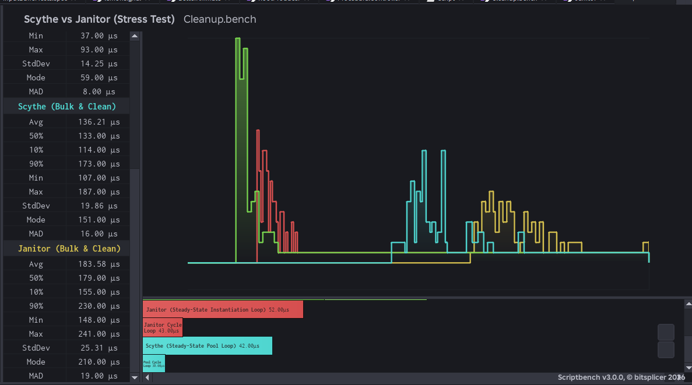

# Scythe 🔪🩸

[](https://github.com/Rexen-Studios/FF)
[](LICENSE)
[](https://luau-lang.org)

A data-oriented cleanup library for Roblox Luau.

Unlike conventional cleanup tools like [Janitor](https://github.com/howmanysmall/Janitor), [Maid](https://github.com/devSparkle/Maid), or [Trove](https://sleitnick.github.io/RbxUtil/api/Trove/), **Scythe** uses no objects, no metatables, no dependencies, and has zero per-instance allocation cost. A scope is simply an integer handle referencing module-level Structure-of-Arrays (SoA) storage.

---

## Installation

Download and copy the latest release into your project and require it:

```luau
local Scythe = require(path.to.Scythe)
```

The module exports a `Scope` type alias for typed Luau:

```luau
local scope: Scythe.Scope = Scythe.scope()
```

---

## Key Features

- ⚡ **Zero Per-Instance Allocation Overhead**: Scopes are managed as integer handles backed by module-level SoA buffers.
- 🚀 **Fast Disposal Loop**: The disposal method is resolved **once** at `add` time and stored as a `u8` tag. The `clean` hot loop is a branch on an integer read straight out of a buffer - avoiding `typeof`, method sniffing, and `pcall` overhead.
- 🔄 **LIFO Cleanup Order**: Resources are disposed in reverse insertion order (Last-In, First-Out), matching resource acquisition semantics.
- ♻️ **Pooled Handles**: Scope handles are recycled to maintain optimal memory and cache performance.
- 🛡️ **Strict Typing**: Written under `--!strict` with full type annotations. All public APIs are fully compatible with strict-mode Luau — no type errors, no casts required.

---

## Benchmarks

Scythe consistently outperforms [howmanysmall's Janitor](https://github.com/howmanysmall/Janitor) across multiple metrics by about 25-30% in execution time.




<sup><sub>The benchmark file can be found [here.](./src/benchmark.bench.luau) Benchmarks were run on a Ryzen 7 2700X CPU and 32GB of DDR4-2400 RAM. Maid and Trove weren't benchmarked against Scythe as they are frequently less performant than Janitor.</sub></sup>

### Memory Allocation & GC Pressure

- **Cold Allocation**: Scythe aggressively pre-allocates contiguous item arrays and capacity buffers. On first-pass bulk allocation, cold memory footprint is higher than lazily-evaluated dictionaries due to reserved capacity.
- **Warm Pool**: Scope handles `u32` and underlying item buffers are pooled upon `Scythe.destroy()`. In steady-state execution, recycling handles via `freeStack` yields zero heap allocations (ΔMem = 0 KB), completely removing garbage collector pauses on high-frequency cleanup paths.

| Architecture           | Hot-Loop Clean                                   | Steady-State GC Overhead    |
| ---------------------- | ------------------------------------------------ | --------------------------- |
| Janitor / Maid / Trove | O(N) dictionary iteration (hash probes + GC)     | Continuous Heap Allocations |
| Scythe (SoA)           | O(N) contiguous buffer scan (cache-friendly, 0 GC) | 0 KB (Recycled Handles)     |

---

## Usage

```luau
local Scythe = require(path.to.Scythe)

local scope = Scythe.scope()

-- Automatic tag resolution at insertion time:
Scythe.add(scope, workspace.Part)                  -- :Destroy()
Scythe.add(scope, humanoid.Died:Connect(onDied))   -- :Disconnect()
Scythe.add(scope, task.spawn(loop))                -- task.cancel()
Scythe.add(scope, function() print("bye") end)     -- called
Scythe.add(scope, customSignal)                    -- table w/ :Disconnect()
Scythe.add(scope, customObject)                    -- table w/ :Destroy()

-- add() returns the value, so you can inline it:
local part = Scythe.add(scope, Instance.new("Part"))
local conn = Scythe.add(scope, signal:Connect(handler))

-- Remove a value without disposing it (ownership transfer):
Scythe.remove(scope, conn)

-- Cleanup operations:
Scythe.clean(scope)   -- Disposes everything, scope remains usable

-- Check how many items a scope is tracking:
assert(Scythe.count(scope) == 0, "scope leaked items!")

Scythe.destroy(scope) -- Disposes everything and recycles the scope handle
```

---

## API Reference

| Function | Signature | Description |
| --- | --- | --- |
| `scope` | `() → Scope` | Acquire a cleanup scope. Recycled handles are reused with warm capacity. |
| `add` | `(scope, value: T) → T` | Track a value for cleanup. Disposal method is resolved once at add-time. Returns the value for inline chaining. |
| `remove` | `(scope, value) → boolean` | Untrack a value via O(1) swap-removal without disposing it. Returns `true` if found. |
| `clean` | `(scope) → ()` | Dispose all tracked values in LIFO order. Scope remains valid and reusable. |
| `destroy` | `(scope) → ()` | Dispose all tracked values, then recycle the handle back to the pool. |
| `count` | `(scope) → number` | Return the number of live items. Single buffer read — effectively free. |

### Supported Types

| Value | Disposal |
| --- | --- |
| `RBXScriptConnection` | `:Disconnect()` |
| `Instance` | `:Destroy()` |
| `function` | called directly |
| `thread` | `task.cancel()` |
| table with `:Destroy()` | `:Destroy()` |
| table with `:Disconnect()` | `:Disconnect()` |

Passing a value that matches none of the above will error — Scythe refuses to silently leak.

---

## Internal Architecture

```luau
scopeItems : { {unknown} }  -- payloads, one array per scope
scopeTags  : { buffer }     -- u8 disposal tag per item
scopeLens  : buffer         -- u32 live item count per scope
scopeCaps  : buffer         -- u32 tag-buffer capacity per scope
freeStack  : buffer         -- u32 recycled handle stack
```

---

## Important Notes

> [!WARNING]
> **No `pcall` Wrapping**: Disposal operations are **not** wrapped in `pcall`. If a cleanup callback throws an error, it will abort the remainder of that `clean()` call. Ensure cleanup callbacks are total (error-free).

> [!CAUTION]
> **Recycled Handles**: Scope handles are pooled upon destruction. Accessing or modifying a handle after `Scythe.destroy(scope)` is undefined behavior, as the handle may be reassigned to a newer scope. Treat `destroy()` as final.

---

## Metadata

- **Version**: `1.0.0`
- **Author**: `checcerr` | `fridayqx`
- **License**: [Mozilla Public License 2.0 (MPL-2.0)](LICENSE)
