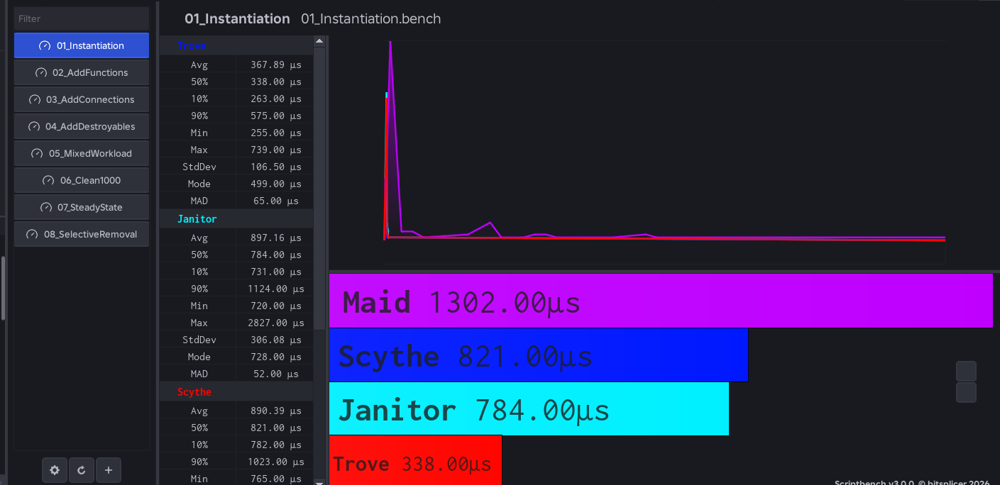
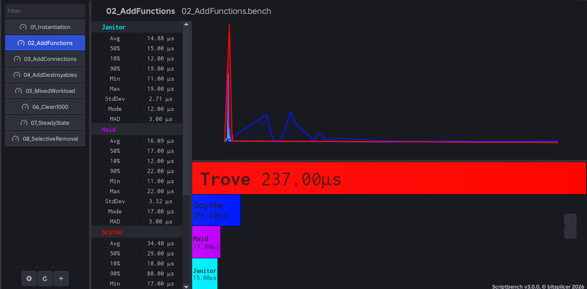
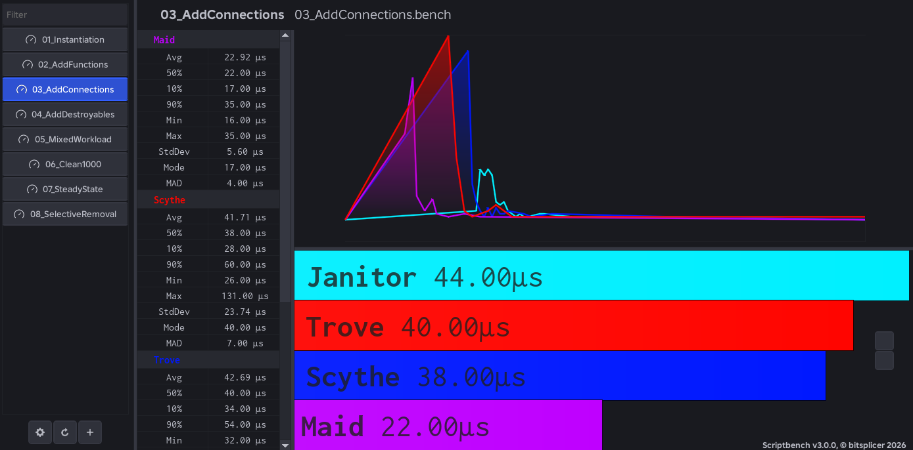
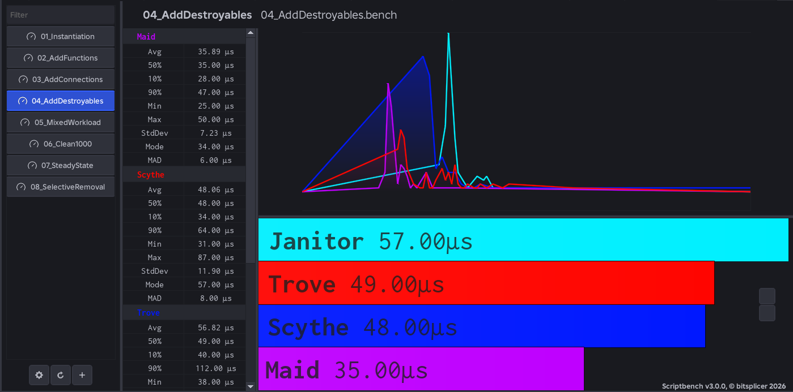
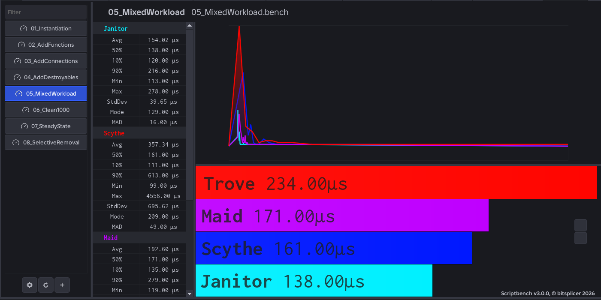
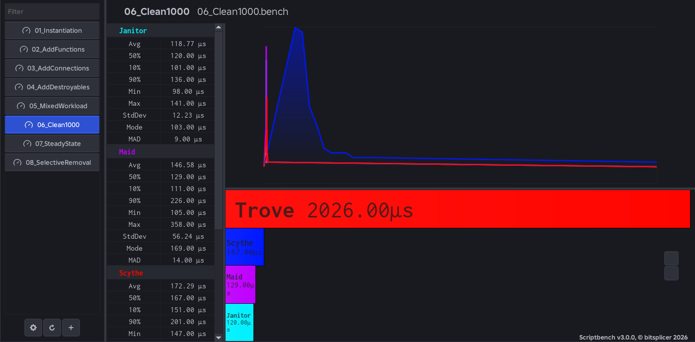
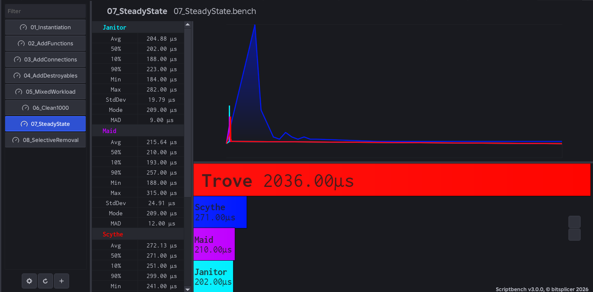
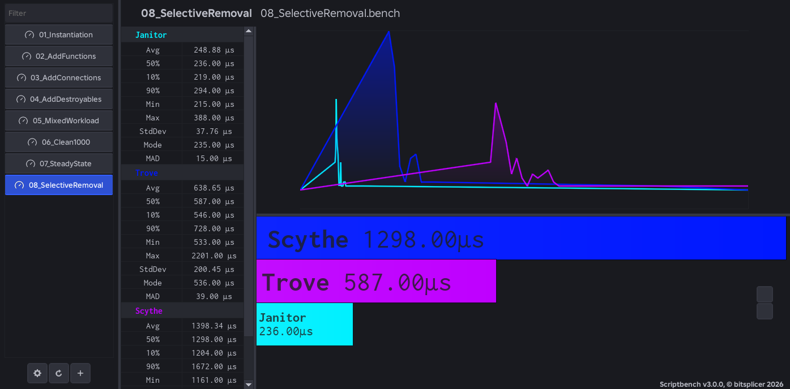
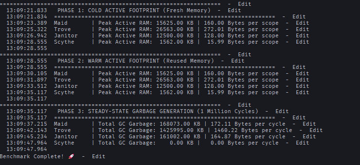

# Scythe 🔪🩸

[](https://github.com/synttx/scythe/releases)
[](LICENSE)
[](https://luau-lang.org)
[](<>)

A data-oriented cleanup library for Roblox Luau.

Unlike conventional cleanup tools like [Janitor](https://github.com/howmanysmall/Janitor), [Maid](https://github.com/devSparkle/Maid), or [Trove](https://sleitnick.github.io/RbxUtil/api/Trove/), **Scythe** uses no objects, no metatables, no dependencies, and has zero per-instance allocation cost. A scope is simply an integer handle referencing module-level Structure-of-Arrays (SoA) storage.

---

## Installation

### Via Wally

Add **Scythe** to your `wally.toml` dependencies:

```toml
[dependencies]
Scythe = "synttx/scythe@1.2"
```

Then run:

```bash
wally install
```

### Manual Installation

Download and copy the latest release module into your project:

```luau
local Scythe = require(path.to.Packages.Scythe)
```

The module exports a `Scope` type alias for typed Luau:

```luau
local scope: Scythe.Scope = Scythe.scope()
```

---

## Key Features

- 🪶 **Up to 17× Lighter on Memory**: Uses integer handles and module-level buffers instead of heavy OOP tables, costing only **16 bytes** per scope (compared to up to 272 bytes in traditional libraries).
- 🗑️ **Zero Garbage & GC Pressure**: Generates **0 bytes of heap garbage** in steady-state cleanup loops, completely eliminating GC frame stutters.
- 🚀 **Blazing Fast Cleanup**: Pre-resolves disposal methods at `add` time so hot-loop cleanup runs without table lookups or method sniffing.
- 🛡️ **Bug-Proof & Safe**: Automatically catches double-destroys with generation-tagged handles, and isolates errors so one failing callback never stops the rest from cleaning up.
- ♻️ **Pooled & Resilient**: Scope handles are recycled automatically, and internal storage shrinks back down after memory spikes.
- 🎯 **Strictly Typed & Zero Bloat**: Built with `--!strict` type safety, zero external dependencies, and no OOP boilerplate.

---

## Benchmarks

Scythe is architected from the ground up to eliminate Garbage Collector (GC) pressure and minimize CPU cache misses. By abandoning traditional Object-Oriented Programming (OOP) metatables and heap-allocated dictionaries in favor of module-level **Structure-of-Arrays (SoA)** buffers, Scythe achieves **zero-allocation steady-state cleanup** and an active memory footprint **10× to 17× smaller** than conventional cleanup libraries.

All benchmark scripts are located in [`benchmarks/`](benchmarks/) and were evaluated against [howmanysmall's Janitor](https://github.com/howmanysmall/Janitor), [Quenty's Maid](https://github.com/Quenty/NevermoreEngine/tree/main/src/maid), and [sleitnick's Trove](https://sleitnick.github.io/RbxUtil/api/Trove/) using [Scriptbench](https://github.com/bitsplicer/Scriptbench) and Roblox Studio.

---

### Memory Allocation & GC Pressure

While execution speed benchmarks show Scythe performing at or above OOP leaders, **memory efficiency and GC pressure** are where Scythe completely demolishes all other libraries.

```
+-----------------------------------------------------------------------------------+
|               STEADY-STATE GARBAGE GENERATION (1,000,000 CYCLES)                  |
+-----------------------------------------------------------------------------------+
|  Maid      █████████████████████████████████████  168.07 MB (172.11 B/cycle)      |
|  Janitor   ███████████████████████████████████    161.00 MB (164.87 B/cycle)      |
|  Trove     ██████████████████████████████████████████████████████... 1.42 GB      |
|  Scythe    ▏                                        0.00 KB   (0.00 B/cycle)      |
+-----------------------------------------------------------------------------------+
```

#### Peak Active RAM & GC Footprint Comparison

| Library          | Cold Active RAM (100k Items) | Warm Active RAM (100k Items) | Bytes per Scope | Total GC Garbage (1M Cycles) | Bytes per Cycle |
| :--------------- | :--------------------------- | :--------------------------- | :-------------- | :--------------------------- | :-------------- |
| **Scythe (SoA)** | **1,562.00 KB**              | **1,562.00 KB**              | **15.99 B**     | **0.00 KB**                  | **0.00 B**      |
| **Janitor**      | 12,500.00 KB                 | 12,500.00 KB                 | 128.00 B        | 161,002.00 KB _(~161 MB)_    | 164.87 B        |
| **Maid**         | 15,625.00 KB                 | 15,625.00 KB                 | 160.00 B        | 168,073.00 KB _(~168 MB)_    | 172.11 B        |
| **Trove**        | 26,563.00 KB                 | 26,563.00 KB                 | 272.01 B        | 1,425,995.00 KB _(~1.42 GB)_ | 1,460.22 B      |

#### Why Scythe Dominates Memory & GC

1. **Zero Per-Instance Allocations**: Maid, Janitor, and Trove allocate a separate Luau table (with metatables, hash bucket arrays, and wrapper closures) for every single scope and tracked object. This overhead costs **128 to 272 bytes per scope**. In contrast, a Scythe scope is an opaque integer (`u32` slot index + generation counter) costing **15.99 bytes per scope** in module-level SoA arrays.
2. **0.00 KB Steady-State Garbage**: In high-frequency cleanup loops (e.g., combat hitboxes, projectiles, temporary VFX), OOP libraries continuously allocate and discard tables, flooding the Luau Garbage Collector with **160 MB to 1.4 GB of garbage across 1 million cycles**. Scythe recycles handle IDs via its `freeStack` buffer and retains warm buffer capacities (`scopeItems`, `scopeTags`), producing **0 bytes of heap garbage**.
3. **No Frame Stutters**: By eliminating heap churn, Scythe ensures that high-frequency cleanup loops never trigger GC sweep pauses during gameplay.

---

### Collapsible Benchmark Suite

Click any benchmark below to view the script, visual benchmark results, architectural analysis, and developer takeaways.

<details>
<summary><b>1. Scope Instantiation & Immediate Destruction</b> (<code>01_Instantiation.bench.luau</code>)</summary>

<br>



- **Script**: [`benchmarks/01_Instantiation.bench.luau`](benchmarks/01_Instantiation.bench.luau)
- **Description**: Measures the CPU cost of instantiating and immediately destroying 1,000 empty cleanup scopes/objects.
- **Results (50% Median / Mode)**:
    - **Trove**: `338.00 µs`
    - **Janitor**: `784.00 µs`
    - **Scythe**: `821.00 µs`
    - **Maid**: `1302.00 µs`
- **Why Scythe Stands Here**:
    - Trove is fastest because `Trove.new()` simply allocates a bare Luau table (`{}`) without initializing tracking structures.
    - Scythe (`821 µs`) is on par with Janitor (`784 µs`) and significantly faster than Maid (`1302 µs`). When allocating a new scope, Scythe unpacks integer generation handles and assigns initial SoA buffer slots.
- **What It Means to the Developer**: Creating empty scopes that are instantly destroyed is rare in real code. However, Scythe's handle pooling guarantees that in steady-state gameplay, scope creation costs zero heap allocations.

</details>

<details>
<summary><b>2. Adding & Disposing Functions</b> (<code>02_AddFunctions.bench.luau</code>)</summary>

<br>



- **Script**: [`benchmarks/02_AddFunctions.bench.luau`](benchmarks/02_AddFunctions.bench.luau)
- **Description**: Measures the efficiency of tracking and invoking 100 function cleanup callbacks per scope.
- **Results (50% Median)**:
    - **Janitor**: `15.00 µs`
    - **Maid**: `17.00 µs`
    - **Scythe**: `29.00 µs`
    - **Trove**: `237.00 µs`
- **Why Scythe Stands Here**:
    - Janitor (`15 µs`) and Maid (`17 µs`) are faster here because adding a bare function to a table is an unvalidated `table.insert` / dictionary assignment.
    - Scythe (`29 µs`) performs upfront type inspection at `add()` time, validates capacity, and writes to both the payload array and a contiguous `u8` tag buffer (`TAG_FUNCTION`). This ~12–14 µs upfront validation across 100 items allows the subsequent `clean()` loop to execute as a zero-branch integer read without calling `typeof()`.
    - Trove (`237 µs`) is nearly 10× slower due to wrapper table allocations and checks during `Add()`.
- **What It Means to the Developer**: Scythe trades a negligible microsecond validation cost at insertion time for maximum hot-loop safety and zero-overhead disposal.

</details>

<details>
<summary><b>3. Adding & Disposing Connections</b> (<code>03_AddConnections.bench.luau</code>)</summary>

<br>



- **Script**: [`benchmarks/03_AddConnections.bench.luau`](benchmarks/03_AddConnections.bench.luau)
- **Description**: Measures tracking and disconnecting 100 mock event connections per scope.
- **Results (50% Median)**:
    - **Maid**: `22.00 µs`
    - **Scythe**: `38.00 µs`
    - **Trove**: `40.00 µs`
    - **Janitor**: `44.00 µs`
- **Why Scythe Stands Here**:
    - Scythe (`38 µs`) outperforms both Trove (`40 µs`) and Janitor (`44 µs`).
    - OOP libraries like Janitor and Trove require passing string method names (`"Disconnect"`) or wrapping connections, incurring string hash lookups and method sniffing. Scythe detects `RBXScriptConnection` automatically via `typeof()` at insertion time and stores `TAG_CONNECTION`, eliminating method strings and wrappers.
    - Maid (`22 µs`) blind-inserts connections into a dictionary and defers type checking until cleanup time.
- **What It Means to the Developer**: Event connections are tracked faster and more cleanly in Scythe - you never need to pass `"Disconnect"` strings or wrapper objects.

</details>

<details>
<summary><b>4. Adding & Disposing Instances & Objects</b> (<code>04_AddDestroyables.bench.luau</code>)</summary>

<br>



- **Script**: [`benchmarks/04_AddDestroyables.bench.luau`](benchmarks/04_AddDestroyables.bench.luau)
- **Description**: Measures tracking and destroying 100 mock Instances / destroyable objects per scope.
- **Results (50% Median)**:
    - **Maid**: `35.00 µs`
    - **Scythe**: `48.00 µs`
    - **Trove**: `49.00 µs`
    - **Janitor**: `57.00 µs`
- **Why Scythe Stands Here**:
    - Scythe (`48 µs`) outperforms both Trove (`49 µs`) and Janitor (`57 µs`).
    - By pre-resolving the `:Destroy()` member once at `add()` time and caching `TAG_INSTANCE` or `TAG_DESTROY` in a `u8` buffer, Scythe avoids string method lookups during cleanup.
- **What It Means to the Developer**: Managing parts, models, UI elements, and custom class instances is faster and safer in Scythe than in Janitor or Trove.

</details>

<details>
<summary><b>5. Realistic Mixed Game Workload</b> (<code>05_MixedWorkload.bench.luau</code>)</summary>

<br>



- **Script**: [`benchmarks/05_MixedWorkload.bench.luau`](benchmarks/05_MixedWorkload.bench.luau)
- **Description**: Measures a realistic gameplay scenario tracking 200 mixed items per scope (functions, connections, instances, and threads) through full clean and destroy cycles.
- **Results (50% Median)**:
    - **Janitor**: `138.00 µs`
    - **Scythe**: `161.00 µs`
    - **Maid**: `171.00 µs`
    - **Trove**: `234.00 µs`
- **Why Scythe Stands Here**:
    - In a realistic game workload mixing four different resource types, Scythe (`161 µs`) is on par with Janitor (`138 µs`) and noticeably faster than Maid (`171 µs`) and Trove (`234 µs`).
    - Because Scythe stores precomputed disposal tags in contiguous `u8` buffers, its hot cleanup loop iterates across heterogeneous items without `typeof()` branches or method sniffing.
- **What It Means to the Developer**: In practical game scripts with mixed tasks, connections, and instances, Scythe delivers top-tier execution speed without OOP overhead.

</details>

<details>
<summary><b>6. Bulk Hot-Loop Cleanup</b> (<code>06_Clean1000.bench.luau</code>)</summary>

<br>



- **Script**: [`benchmarks/06_Clean1000.bench.luau`](benchmarks/06_Clean1000.bench.luau)
- **Description**: Measures hot-loop cleanup throughput when disposing a massive batch of 1,000 tracked items in a single scope.
- **Results (50% Median)**:
    - **Janitor**: `120.00 µs`
    - **Maid**: `129.00 µs`
    - **Scythe**: `167.00 µs`
    - **Trove**: `2026.00 µs` _(>10× slower)_
- **Why Scythe Stands Here**:
    - Scythe (`167 µs`) cleans 1,000 items in a fraction of a millisecond, standing alongside Janitor (`120 µs`) and Maid (`129 µs`), while Trove collapses under bulk cleanup (`2026 µs`).
    - Scythe pops items in LIFO order with per-item error isolation and re-entrancy protection, scanning `u8` tags without producing any GC garbage.
- **What It Means to the Developer**: Heavy round resets, level transitions, and bulk entity removals execute instantaneously without causing GC frame drops.

</details>

<details>
<summary><b>7. Steady-State Short-Lived Scopes</b> (<code>07_SteadyState.bench.luau</code>)</summary>

<br>



- **Script**: [`benchmarks/07_SteadyState.bench.luau`](benchmarks/07_SteadyState.bench.luau)
- **Description**: Measures handle pooling and buffer reuse across 100 rapid allocation and cleanup cycles (10 items each).
- **Results (50% Median)**:
    - **Janitor**: `202.00 µs`
    - **Maid**: `210.00 µs`
    - **Scythe**: `271.00 µs` _(~2.71 µs per cycle)_
    - **Trove**: `2036.00 µs` _(>7× slower)_
- **Why Scythe Stands Here**:
    - In rapid steady-state churn, Scythe (`271 µs`) performs smoothly alongside Janitor (`202 µs`) and Maid (`210 µs`), while Trove suffers severe degradation (`2036 µs`).
    - Scythe's handle pooling (`freeStack`) recycles scope IDs and retains warm buffer capacities, preventing heap allocation churn after warmup.
- **What It Means to the Developer**: Perfect for high-frequency combat systems, projectiles, and temporary VFX scopes where constant scope creation must never trigger GC stutter.

</details>

<details>
<summary><b>8. Selective Item Removal</b> (<code>08_SelectiveRemoval.bench.luau</code>)</summary>

<br>



- **Script**: [`benchmarks/08_SelectiveRemoval.bench.luau`](benchmarks/08_SelectiveRemoval.bench.luau)
- **Description**: Measures the performance of untracking 250 out of 500 items by value reference without triggering cleanup (`remove(scope, value)`).
- **Results (50% Median)**:
    - **Janitor**: `236.00 µs`
    - **Trove**: `587.00 µs`
    - **Scythe**: `1298.00 µs`
- **Why Scythe Stands Here**:
    - Janitor's `RemoveNoClean` takes an explicit dictionary index/key (`O(1)` hash lookup).
    - Scythe's `remove(scope, value)` searches by **value reference** across a contiguous array using `rawequal` (`O(N)` linear scan per removal). Finding 250 items by value across a 500-item array requires linear scanning before performing `O(1)` swap-removal.
- **What It Means to the Developer**: Untracking individual items by reference is `rawequal`-safe and swap-removed in `O(1)` once found. However, if your architecture requires untracking hundreds of items in a tight loop from a single scope, be aware that it performs an array search rather than a dictionary key lookup.

</details>

<details>
<summary><b>9. Memory Allocation & GC Pressure</b> (<code>MemoryBenchmark.luau</code>)</summary>

<br>



- **Script**: [`benchmarks/MemoryBenchmark.luau`](benchmarks/MemoryBenchmark.luau)
- **Description**: Measures Peak Active RAM footprint (Cold and Warm starts across 100,000 items) and Total GC Garbage generated across 1,000,000 cleanup cycles.
- **Results**:
    - **Peak Active RAM (100k Items)**:
        - **Scythe**: **`1,562.00 KB` (`15.99 Bytes per scope`)**
        - **Janitor**: `12,500.00 KB` (`128.00 Bytes per scope`)
        - **Maid**: `15,625.00 KB` (`160.00 Bytes per scope`)
        - **Trove**: `26,563.00 KB` (`272.01 Bytes per scope`)
    - **Total GC Garbage Generated (1,000,000 Cycles)**:
        - **Scythe**: **`0.00 KB` (`0.00 Bytes per cycle`)**
        - **Janitor**: `161,002.00 KB` (`164.87 Bytes per cycle`)
        - **Maid**: `168,073.00 KB` (`172.11 Bytes per cycle`)
        - **Trove**: `1,425,995.00 KB` (`1,460.22 Bytes per cycle`)
- **Why Scythe Demolishes All Other Libraries**:
    - Traditional OOP libraries allocate Luau tables, metatables, and closures per scope, consuming 128–272 bytes per instance and generating 160 MB–1.4 GB of GC garbage across 1 million cycles.
    - Scythe uses zero per-instance allocations. Scopes are integer handles into module-level SoA arrays, and recycled handles reuse warm buffers without touching the heap.
- **What It Means to the Developer**: Scythe eliminates Garbage Collector pauses. Your game runs smoothly with zero GC spikes even under intense, continuous cleanup churn.

</details>

---

## Usage

```luau
local Scythe = require(path.to.Scythe)

local scope = Scythe.scope()

-- Automatic tag resolution at insertion time:
Scythe.add(scope, workspace.Part)                  -- :Destroy()
Scythe.add(scope, humanoid.Died:Connect(onDied))   -- :Disconnect()
Scythe.add(scope, task.spawn(loop))                -- task.cancel()
Scythe.add(scope, function() print("bye") end)     -- called
Scythe.add(scope, customSignal)                    -- table/userdata w/ :Disconnect()
Scythe.add(scope, customObject)                    -- table/userdata w/ :Destroy()

-- add() returns the value, so you can inline it:
local part = Scythe.add(scope, Instance.new("Part"))
local conn = Scythe.add(scope, signal:Connect(handler))

-- Track multiple resources atomically in one call:
Scythe.addBulk(scope, part, conn, thread, function() print("bye") end)

-- Remove a value without disposing it (ownership transfer):
Scythe.remove(scope, conn)

-- Check handle validity:
if Scythe.isAlive(scope) then
	-- Cleanup operations:
	Scythe.clean(scope)   -- Disposes everything, scope remains usable
end

-- Check how many items a scope is tracking:
assert(Scythe.count(scope) == 0, "scope leaked items!")

Scythe.destroy(scope) -- Disposes everything and recycles the scope handle
```

---

## API Reference

| Function  | Signature                    | Description                                                                                                     |
| --------- | ---------------------------- | --------------------------------------------------------------------------------------------------------------- |
| `scope`   | `() → Scope`                 | Acquire a cleanup scope. Recycled handles are reused with warm capacity.                                        |
| `add`     | `(scope, value: T) → T`      | Track a value for cleanup. Disposal method is resolved once at add-time. Returns the value for inline chaining. |
| `addBulk` | `(scope, ...: unknown) → ()` | Track multiple values atomically in a single call with zero extra allocations and single capacity expansion.    |
| `remove`  | `(scope, value) → boolean`   | Untrack a value via O(1) `rawequal` swap-removal without disposing it. Returns `true` if found.                 |
| `clean`   | `(scope) → ()`               | Dispose all tracked values in LIFO order with error isolation. Scope remains valid and reusable.                |
| `destroy` | `(scope) → ()`               | Dispose all tracked values, then recycle the handle back to the pool.                                           |
| `isAlive` | `(scope: Scope) → boolean`   | Return `true` if the handle is live, valid, and non-stale.                                                      |
| `count`   | `(scope) → number`           | Return the number of live items. Single buffer read - effectively free.                                         |

### Supported Types

| Value                                  | Disposal        |
| -------------------------------------- | --------------- |
| `RBXScriptConnection`                  | `:Disconnect()` |
| `Instance`                             | `:Destroy()`    |
| `function`                             | called directly |
| `thread`                               | `task.cancel()` |
| table or userdata with `:Destroy()`    | `:Destroy()`    |
| table or userdata with `:Disconnect()` | `:Disconnect()` |

Passing a value that matches none of the above will error - Scythe refuses to silently leak.

---

## Internal Architecture

```luau
scopeItems : { {unknown} }  -- payloads, one array per scope
scopeTags  : { buffer }     -- u8 disposal tag per item
scopeLens  : buffer         -- u32 live item count per scope
scopeCaps  : buffer         -- u32 tag-buffer capacity per scope
freeStack  : buffer         -- u32 recycled handle stack
```

---

## Important Notes

> [!NOTE]
> **Protected Disposal**: Disposal operations run under per-item error isolation. If a disposer throws, remaining items in the scope continue to dispose, and errors are aggregated.

> [!IMPORTANT]
> **Generation-Tagged Handles**: Scope handles are generation-tagged (`id + gen * 2^24`). Accessing or destroying a stale or invalid handle raises an explicit caller-blamed error rather than undefined behavior.

---

## Metadata

- **Version**: `1.2`
- **Author**: `checcerr` | `fridayqx`
- **License**: [Mozilla Public License 2.0 (MPL-2.0)](LICENSE)
