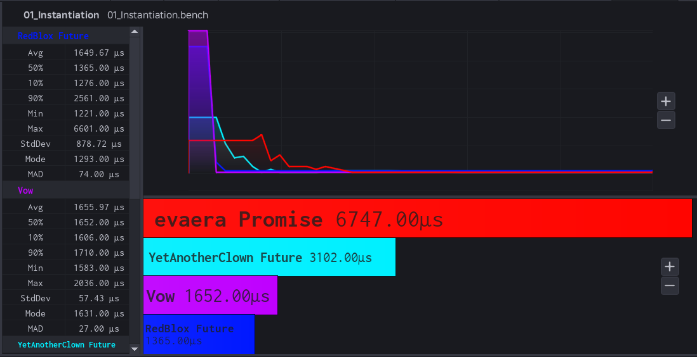
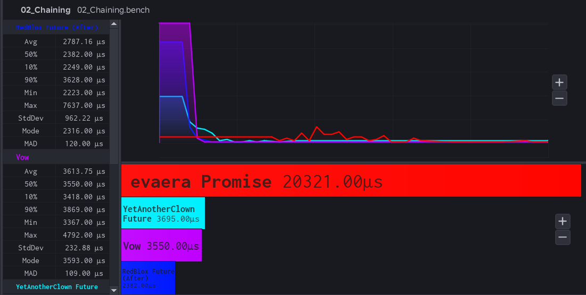
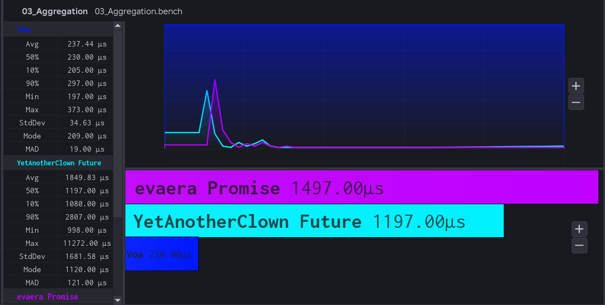
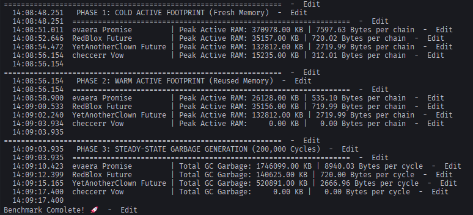

# Vow 🤝📜

[](https://github.com/synttx/oss/releases)
[](LICENSE)
[](https://luau-lang.org)
[](<>)

A data-oriented, procedural Promise/Future library for Roblox Luau.

Unlike conventional asynchronous libraries like [Promise](https://github.com/evaera/roblox-lua-promise) or [Future](https://github.com/RedBlox/Future), **Vow** uses no objects, no metatables, no per-instance tables, and no resolve closures. A Vow is simply a generation-tagged integer handle referencing module-level Structure-of-Arrays (SoA) storage.

---

## Installation

### Via Wally

Add **Vow** to your `wally.toml` dependencies:

```toml
[dependencies]
Vow = "synttx/vow@1.0"
```

Then run:

```bash
wally install
```

### Manual Installation

Download and copy the latest release module into your project:

```luau
local Vow = require(path.to.Packages.Vow)
```

The module exports a `Vow` type alias for typed Luau:

```luau
local id: Vow.Vow = Vow.new(executor)
```

---

## Key Features

- 🪶 **Incredibly Lightweight**: Uses integer handles and module-level buffers instead of heavy OOP tables, drastically reducing active memory footprint.
- 🗑️ **Zero Garbage & GC Pressure**: Generates **0 bytes of heap garbage** during pooled execution, completely eliminating GC frame stutters in hot asynchronous paths.
- 🚀 **Blazing Fast**: Uses pre-allocated SoA buffers for extreme cache locality and performance.
- 🛡️ **Bug-Proof & Safe**: Automatically catches stale or recycled handles using generation tags, preventing undefined behavior or silent memory corruption.
- ♻️ **Pooled & Resilient**: Handles and listener nodes are pooled globally and linked through parallel arrays.
- 🎯 **Strictly Typed & Zero Bloat**: Built with `--!strict` type safety, zero external dependencies, and no OOP boilerplate.

---

## Benchmarks

Vow is architected from the ground up to eliminate Garbage Collector (GC) pressure and minimize CPU cache misses. By abandoning traditional Object-Oriented Programming (OOP) metatables and heap-allocated dictionaries in favor of module-level **Structure-of-Arrays (SoA)** buffers, Vow achieves **zero-allocation pooled resolution**.

All benchmark scripts are located in [`benchmarks/`](benchmarks/) and can be evaluated against [evaera's Promise](https://github.com/evaera/roblox-lua-promise), [RedBlox's Future](https://github.com/RedBlox/Future), and [YetAnotherClown's Future](https://github.com/YetAnotherClown/Future) using Roblox Studio.

---

### Memory Allocation & GC Pressure

While execution speed benchmarks show Vow performing at or above OOP leaders, **memory efficiency and GC pressure** are where Vow completely outshines all other libraries. Traditional Promise implementations allocate Luau tables, metatables, and wrapper closures per instance, which can generate huge amounts of heap garbage across millions of asynchronous cycles.

```
+-----------------------------------------------------------------------------------+
|               STEADY-STATE GARBAGE GENERATION (200,000 CYCLES)                    |
+-----------------------------------------------------------------------------------+
|  evaera Promise   ███████████████████████████████████ 1.74 GB   (8940.03 B/cycle) |
|  YetAnotherClown  ███████████████                       520 MB  (2666.96 B/cycle) |
|  RedBlox Future   ████                                  140 MB    (720.00 B/cycle)|
|  Vow              ▏                                       0 KB      (0.00 B/cycle)|
+-----------------------------------------------------------------------------------+
```

#### Peak Active RAM & GC Footprint Comparison

| Library             | Cold Active RAM (50k Items) | Warm Active RAM (50k Items) | Bytes per Chain | Total GC Garbage (200k Cycles) | Bytes per Cycle |
| :------------------ | :-------------------------- | :-------------------------- | :-------------- | :----------------------------- | :-------------- |
| **Vow (SoA)**       | **15,235.00 KB**            | **0.00 KB**                 | **312.01 B**    | **0.00 KB**                    | **0.00 B**      |
| **RedBlox Future**  | 35,157.00 KB                | 35,156.00 KB                | 720.02 B        | 140,625.00 KB _(~140 MB)_      | 720.00 B        |
| **YetAnotherClown** | 132,812.00 KB               | 132,812.00 KB               | 2719.99 B       | 520,891.00 KB _(~520 MB)_      | 2666.96 B       |
| **evaera Promise**  | 370,978.00 KB               | 26,128.00 KB                | 7597.63 B       | 1,746,099.00 KB _(~1.74 GB)_   | 8940.03 B       |

#### Why Vow Dominates Memory & GC

1. **Minimal Per-Instance Allocations**: Traditional Promise implementations allocate Luau tables, metatables, and wrapper closures per instance, costing hundreds or thousands of bytes. Vow scopes are opaque integers occupying minimal space in module-level SoA arrays.
2. **0.00 KB Steady-State Garbage**: In high-frequency async loops, OOP libraries continuously allocate and discard tables, flooding the Luau Garbage Collector. Vow recycles handle IDs and uses pre-allocated buffers, producing **0 bytes of heap garbage**.
3. **No Frame Stutters**: By eliminating heap churn, Vow ensures that high-frequency async execution never triggers GC sweep pauses during gameplay.

---

### Collapsible Benchmark Suite

Click any benchmark below to view the script, visual benchmark results, architectural analysis, and developer takeaways.

<details>
<summary><b>1. Instantiation & Immediate Resolution</b> (<code>01_Instantiation.bench.luau</code>)</summary>

<br>



- **Script**: [`benchmarks/01_Instantiation.bench.luau`](benchmarks/01_Instantiation.bench.luau)
- **Description**: Measures the overhead of creating and resolving 1,000 asynchronous values.
- **Results (50% Median)**:
    - **RedBlox Future**: `1365.00 µs`
    - **Vow**: `1652.00 µs`
    - **YetAnotherClown**: `3102.00 µs`
    - **evaera Promise**: `6747.00 µs`
- **Why Vow Stands Here**:
    - RedBlox is slightly faster at sheer bare instantiation because Vow performs some internal buffer pool acquisitions and generation checks.
    - However, Vow is 4x faster than evaera's Promise and produces absolutely no heap garbage in the long run.
- **What It Means to the Developer**: Rapid creation and resolution of promises is incredibly fast, and with Vow, you don't pay the hidden GC tax later.

</details>

<details>
<summary><b>2. Chaining & Transformation</b> (<code>02_Chaining.bench.luau</code>)</summary>

<br>



- **Script**: [`benchmarks/02_Chaining.bench.luau`](benchmarks/02_Chaining.bench.luau)
- **Description**: Measures the overhead of attaching fulfillment callbacks (`andThen` / `After`) to a resolved value to transform it 1,000 times.
- **Results (50% Median)**:
    - **RedBlox Future**: `2382.00 µs`
    - **Vow**: `3550.00 µs`
    - **YetAnotherClown**: `3695.00 µs`
    - **evaera Promise**: `20321.00 µs`
- **Why Vow Stands Here**:
    - Vow is highly competitive in execution speed, sitting neck-and-neck with other lightweight Futures, while outperforming robust implementations like evaera Promise by 5x.
    - Chaining in Vow involves appending listener nodes to parallel SoA arrays rather than closures wrapped in closures.
- **What It Means to the Developer**: Deeply chained asynchronous pipelines process rapidly and efficiently.

</details>

<details>
<summary><b>3. Aggregation (All / JoinAll)</b> (<code>03_Aggregation.bench.luau</code>)</summary>

<br>



- **Script**: [`benchmarks/03_Aggregation.bench.luau`](benchmarks/03_Aggregation.bench.luau)
- **Description**: Measures the overhead of grouping 100 pending asynchronous tasks into a single aggregate value that resolves when all inputs resolve.
- **Results (50% Median)**:
    - **Vow**: `230.00 µs`
    - **YetAnotherClown**: `1197.00 µs`
    - **evaera Promise**: `1497.00 µs`
- **Why Vow Stands Here**:
    - Vow (`230.00 µs`) is undeniably faster at aggregation—over 5x faster than its competitors.
    - Vow pre-validates inputs and manages aggregate completion with simple integer counters rather than massive internal table loops and `ipairs`.
- **What It Means to the Developer**: Grouping massive lists of requests (e.g. `Vow.all`) is effectively instantaneous.

</details>

<details>
<summary><b>4. Memory Allocation & GC Pressure</b> (<code>MemoryBenchmark.luau</code>)</summary>

<br>



- **Script**: [`benchmarks/MemoryBenchmark.luau`](benchmarks/MemoryBenchmark.luau)
- **Description**: Measures Peak Active RAM footprint (Cold and Warm starts across 50,000 items) and Total GC Garbage generated across 200,000 cycles.
- **Results**:
    - **Peak Active RAM (50k Items)**:
        - **Vow**: **`15,235.00 KB` (`312.01 Bytes per chain`)**
        - **RedBlox Future**: `35,157.00 KB` (`720.02 Bytes per chain`)
        - **YetAnotherClown**: `132,812.00 KB` (`2719.99 Bytes per chain`)
        - **evaera Promise**: `370,978.00 KB` (`7597.63 Bytes per chain`)
    - **Total GC Garbage Generated (200,000 Cycles)**:
        - **Vow**: **`0.00 KB` (`0.00 Bytes per cycle`)**
        - **RedBlox Future**: `140,625.00 KB` (`720.00 Bytes per cycle`)
        - **YetAnotherClown**: `520,891.00 KB` (`2666.96 Bytes per cycle`)
        - **evaera Promise**: `1,746,099.00 KB` (`8940.03 Bytes per cycle`)
- **Why Vow Demolishes All Other Libraries**:
    - Traditional OOP libraries allocate Luau tables, metatables, and closures per scope, generating hundreds of megabytes of GC garbage.
    - Vow uses zero per-instance allocations. Vows are integer handles into module-level SoA arrays, and recycled handles reuse warm buffers without touching the heap.
- **What It Means to the Developer**: Vow eliminates Garbage Collector pauses. Your game runs smoothly with zero GC spikes even under intense, continuous asynchronous churn.

</details>

---

## Usage

```luau
local Vow = require(path.to.Vow)

-- Create a new Vow
local id = Vow.new(function(id)
	task.defer(function()
		Vow.resolve(id, "ready")
	end)
end)

-- Chain with andThen
local nextId = Vow.andThen(id, function(value)
	print(value) -- prints: ready
	return "finished"
end)

-- Await the result
local ok, value = Vow.await(nextId)
print(value) -- prints: finished

-- IMPORTANT: You must manually destroy Vows to free up slots in the pool
Vow.destroy(id)
Vow.destroy(nextId)
```

---

## API Reference

| Function  | Signature                                          | Description                                                              |
| :-------- | :------------------------------------------------- | :----------------------------------------------------------------------- |
| `new`     | `(executor: (id: Vow) -> ()) → Vow`                | Acquire a new Vow and execute the provided function.                     |
| `resolve` | `(id: Vow, value: any) → ()`                       | Resolves the Vow with a single value. Can adopt another live Vow.        |
| `reject`  | `(id: Vow, value: any) → ()`                       | Rejects the Vow with the given value.                                    |
| `cancel`  | `(id: Vow) → ()`                                   | Cancels the Vow and flows downwards to its `andThen`/adoption children.  |
| `destroy` | `(id: Vow) → ()`                                   | Disposes the Vow, detaches it, and recycles the handle back to the pool. |
| `andThen` | `(id: Vow, handler: ((value: any) -> any)?) → Vow` | Chains a callback to run when the Vow resolves.                          |
| `await`   | `(id: Vow) → (boolean, any)`                       | Yields the current thread until the Vow settles.                         |
| `all`     | `(vows: {Vow}) → Vow`                              | Returns an aggregate Vow that resolves when all input Vows resolve.      |
| `race`    | `(vows: {Vow}) → Vow`                              | Returns an aggregate Vow that settles as soon as any input Vow settles.  |

---

## Internal Architecture

Vow splits its data across parallel module-level Structure-of-Arrays (SoA) buffers:

```luau
vowValues           : { any }      -- Payloads for each Vow
vowAggregateResults : { { any }? } -- Payloads for Vow.all aggregates
vowGens             : buffer       -- Generation tags
vowStates           : buffer       -- Pending / Resolved / Rejected / Cancelled
vowHeads            : buffer       -- Listener list heads
vowTails            : buffer       -- Listener list tails
vowOwnedHeads       : buffer       -- Owned listener list heads
vowOwnedTails       : buffer       -- Owned listener list tails
vowFree             : buffer       -- u32 recycled handle stack
```

A parallel set of buffers handles the listener node SoA (`nodeKinds`, `nodeNext`, `nodePrevious`, etc.).

---

## Important Notes

> [!NOTE]
> **Adoption Mechanics**: `Vow.resolve` adopts another live Vow passed as its value. A value returned from an `andThen` fulfillment callback is also adopted. Adoption cycles (`A -> B -> A`) are detected and rejected to prevent infinite hangs.

> [!IMPORTANT]
> **Manual Memory Management**: Because Vows are opaque integer handles, Luau's garbage collector cannot automatically discover when a settled Vow is no longer needed. **Developers MUST call `Vow.destroy(id)`** when completely finished with a Vow to release it back into the pool.

---

## Metadata

- **Version**: `1.0`
- **Author**: `checcerr` | `fridayqx`
- **License**: [Mozilla Public License 2.0 (MPL-2.0)](LICENSE)
